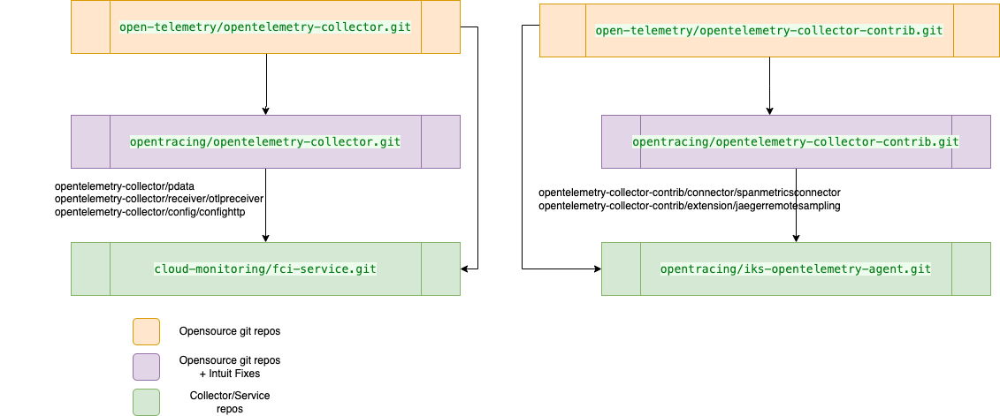

# opentelemetry-collector
This repo is a mirror of https://github.com/open-telemetry/opentelemetry-collector-contrib. All Intuit specific customizations 
are maintained in this repo. The changes are kept in `intuit` branch

## Github Details


## Step To Release New Version

1. Clone the opensource repo
```shell
git clone git@github.com:open-telemetry/opentelemetry-collector-contrib.git
```

2. Go into the repo and link the intuit repo
```shell
git remote add intuit_remote git@github.intuit.com:opentracing/opentelemetry-collector-contrib.git
```

3. Checkout the `intuit` branch from the custom/target repo
```shell
git switch -c intuit intuit_remote/intuit
```

4. Branch out for a new release (e.g) v0.106.0
```shell
git checkout intuit -b intuit_v0.106.0
```

4. Rebase with the release tag that we are upgrading to (e.g) v0.106.0
```shell
git rebase v0.106.0
```

5. Resolve any merge conflicts and test the build
```shell
make
```

6. Commit and push the changes
```shell
git push intuit main
git push intuit intuit_v0.106.0
```

7. Create and push new tags
```shell
sh createAndPushTags.sh v0.106.0-1
```
